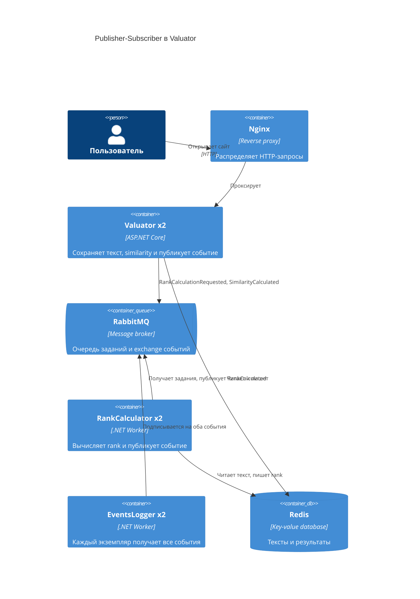

# PA4: C4, уровень контейнеров

```mermaid
C4Container
    title Publisher-Subscriber в Valuator
    Person(user, "Пользователь")
    Container(nginx, "Nginx", "Reverse proxy", "Распределяет HTTP-запросы")
    Container(valuator, "Valuator x2", "ASP.NET Core", "Сохраняет текст, similarity и публикует событие")
    ContainerQueue(rabbit, "RabbitMQ", "Message broker", "Очередь заданий и exchange событий")
    Container(rank, "RankCalculator x2", ".NET Worker", "Вычисляет rank и публикует событие")
    Container(logger, "EventsLogger x2", ".NET Worker", "Каждый экземпляр получает все события")
    ContainerDb(redis, "Redis", "Key-value database", "Тексты и результаты")

    Rel(user, nginx, "Открывает сайт", "HTTP")
    Rel(nginx, valuator, "Проксирует")
    Rel(valuator, redis, "Читает и пишет")
    Rel(valuator, rabbit, "RankCalculationRequested, SimilarityCalculated")
    Rel(rank, rabbit, "Получает задания, публикует RankCalculated")
    Rel(rank, redis, "Читает текст, пишет rank")
    Rel(logger, rabbit, "Подписывается на оба события")
```
