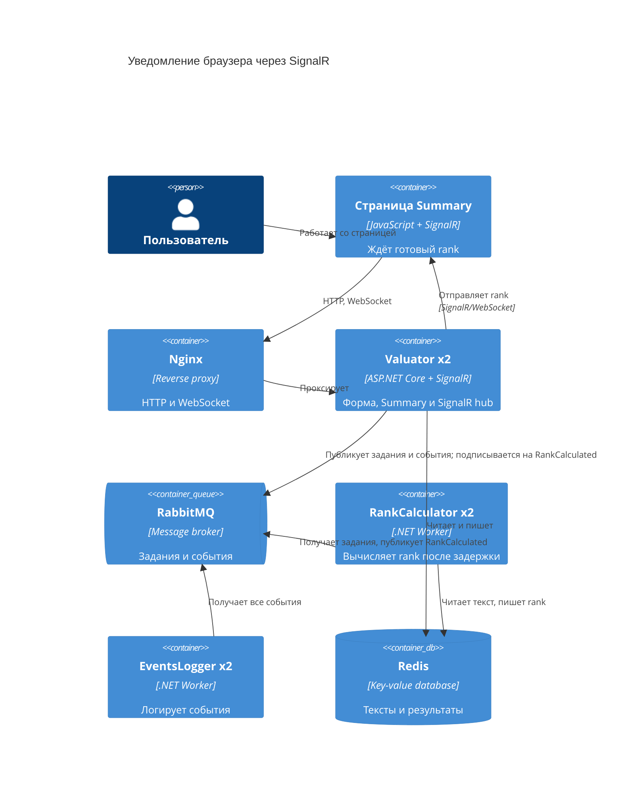

# PA5: C4, уровень контейнеров

```mermaid
C4Container
    title Уведомление браузера через SignalR
    Person(user, "Пользователь")
    Container(browser, "Страница Summary", "JavaScript + SignalR", "Ждёт готовый rank")
    Container(nginx, "Nginx", "Reverse proxy", "HTTP и WebSocket")
    Container(valuator, "Valuator x2", "ASP.NET Core + SignalR", "Форма, Summary и SignalR hub")
    ContainerQueue(rabbit, "RabbitMQ", "Message broker", "Задания и события")
    Container(rank, "RankCalculator x2", ".NET Worker", "Вычисляет rank после задержки")
    Container(logger, "EventsLogger x2", ".NET Worker", "Логирует события")
    ContainerDb(redis, "Redis", "Key-value database", "Тексты и результаты")

    Rel(user, browser, "Работает со страницей")
    Rel(browser, nginx, "HTTP, WebSocket")
    Rel(nginx, valuator, "Проксирует")
    Rel(valuator, rabbit, "Публикует задания и события; подписывается на RankCalculated")
    Rel(rank, rabbit, "Получает задания, публикует RankCalculated")
    Rel(valuator, redis, "Читает и пишет")
    Rel(rank, redis, "Читает текст, пишет rank")
    Rel(valuator, browser, "Отправляет rank", "SignalR/WebSocket")
    Rel(logger, rabbit, "Получает все события")
```
