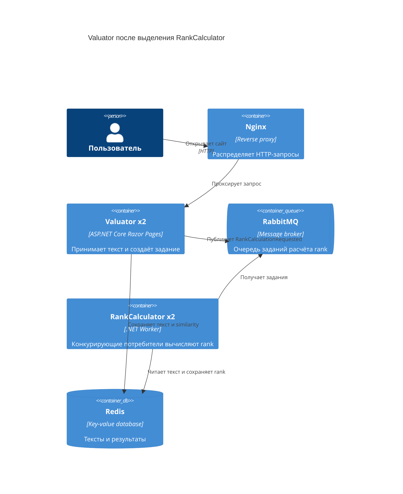

# PA3: C4, уровень контейнеров

```mermaid
C4Container
    title Valuator после выделения RankCalculator
    Person(user, "Пользователь")
    Container(nginx, "Nginx", "Reverse proxy", "Распределяет HTTP-запросы")
    Container(valuator, "Valuator x2", "ASP.NET Core Razor Pages", "Принимает текст и создаёт задание")
    ContainerQueue(rabbit, "RabbitMQ", "Message broker", "Очередь заданий расчёта rank")
    Container(rank, "RankCalculator x2", ".NET Worker", "Конкурирующие потребители вычисляют rank")
    ContainerDb(redis, "Redis", "Key-value database", "Тексты и результаты")

    Rel(user, nginx, "Открывает сайт", "HTTP")
    Rel(nginx, valuator, "Проксирует запрос")
    Rel(valuator, redis, "Сохраняет текст и similarity")
    Rel(valuator, rabbit, "Публикует RankCalculationRequested")
    Rel(rank, rabbit, "Получает задания")
    Rel(rank, redis, "Читает текст и сохраняет rank")
```
