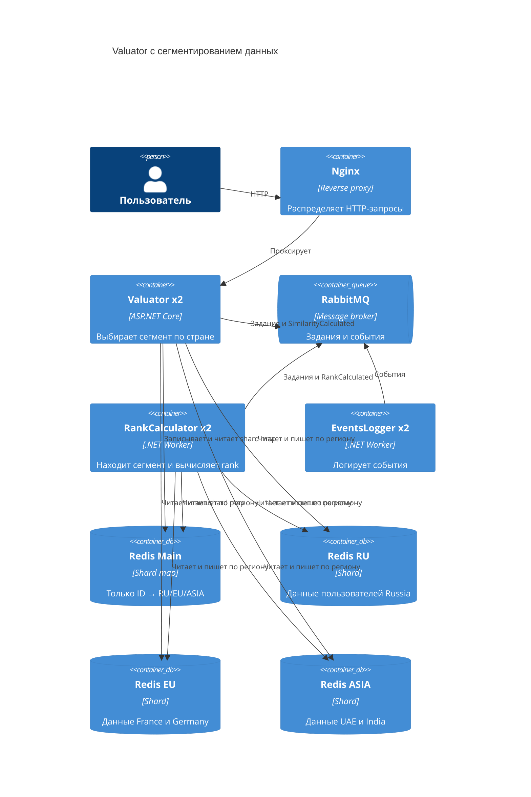

# PA6: C4, уровень контейнеров

```mermaid
C4Container
    title Valuator с сегментированием данных
    Person(user, "Пользователь")
    Container(nginx, "Nginx", "Reverse proxy", "Распределяет HTTP-запросы")
    Container(valuator, "Valuator x2", "ASP.NET Core", "Выбирает сегмент по стране")
    ContainerQueue(rabbit, "RabbitMQ", "Message broker", "Задания и события")
    Container(rank, "RankCalculator x2", ".NET Worker", "Находит сегмент и вычисляет rank")
    Container(logger, "EventsLogger x2", ".NET Worker", "Логирует события")
    ContainerDb(main, "Redis Main", "Shard map", "Только ID → RU/EU/ASIA")
    ContainerDb(ru, "Redis RU", "Shard", "Данные пользователей Russia")
    ContainerDb(eu, "Redis EU", "Shard", "Данные France и Germany")
    ContainerDb(asia, "Redis ASIA", "Shard", "Данные UAE и India")

    Rel(user, nginx, "HTTP")
    Rel(nginx, valuator, "Проксирует")
    Rel(valuator, main, "Записывает и читает shard map")
    Rel(rank, main, "Читает shard map")
    Rel(valuator, ru, "Читает и пишет по региону")
    Rel(valuator, eu, "Читает и пишет по региону")
    Rel(valuator, asia, "Читает и пишет по региону")
    Rel(rank, ru, "Читает и пишет по региону")
    Rel(rank, eu, "Читает и пишет по региону")
    Rel(rank, asia, "Читает и пишет по региону")
    Rel(valuator, rabbit, "Задания и SimilarityCalculated")
    Rel(rank, rabbit, "Задания и RankCalculated")
    Rel(logger, rabbit, "События")
```
