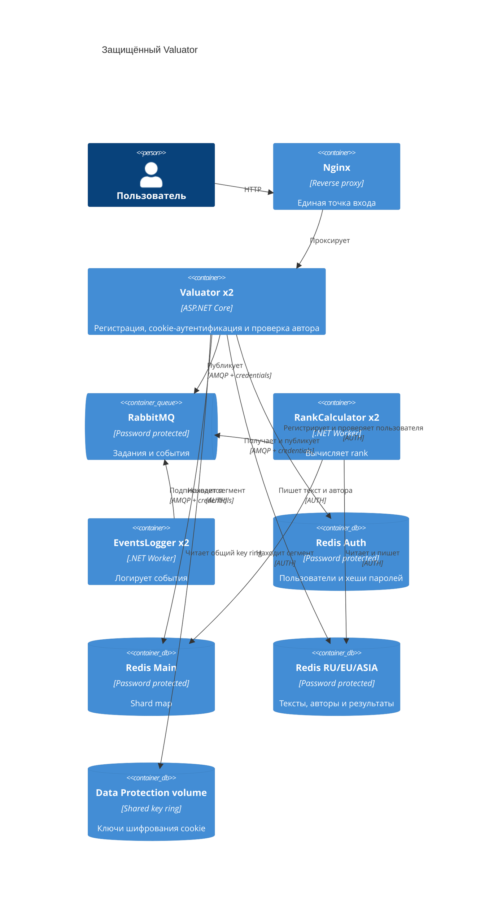

# PA7: C4, уровень контейнеров

```mermaid
C4Container
    title Защищённый Valuator
    Person(user, "Пользователь")
    Container(nginx, "Nginx", "Reverse proxy", "Единая точка входа")
    Container(valuator, "Valuator x2", "ASP.NET Core", "Регистрация, cookie-аутентификация и проверка автора")
    ContainerQueue(rabbit, "RabbitMQ", "Password protected", "Задания и события")
    Container(rank, "RankCalculator x2", ".NET Worker", "Вычисляет rank")
    Container(logger, "EventsLogger x2", ".NET Worker", "Логирует события")
    ContainerDb(auth, "Redis Auth", "Password protected", "Пользователи и хеши паролей")
    ContainerDb(main, "Redis Main", "Password protected", "Shard map")
    ContainerDb(shards, "Redis RU/EU/ASIA", "Password protected", "Тексты, авторы и результаты")
    ContainerDb(keys, "Data Protection volume", "Shared key ring", "Ключи шифрования cookie")

    Rel(user, nginx, "HTTP")
    Rel(nginx, valuator, "Проксирует")
    Rel(valuator, auth, "Регистрирует и проверяет пользователя", "AUTH")
    Rel(valuator, keys, "Читает общий key ring")
    Rel(valuator, main, "Находит сегмент", "AUTH")
    Rel(valuator, shards, "Пишет текст и автора", "AUTH")
    Rel(valuator, rabbit, "Публикует", "AMQP + credentials")
    Rel(rank, rabbit, "Получает и публикует", "AMQP + credentials")
    Rel(rank, main, "Находит сегмент", "AUTH")
    Rel(rank, shards, "Читает и пишет", "AUTH")
    Rel(logger, rabbit, "Подписывается", "AMQP + credentials")
```
