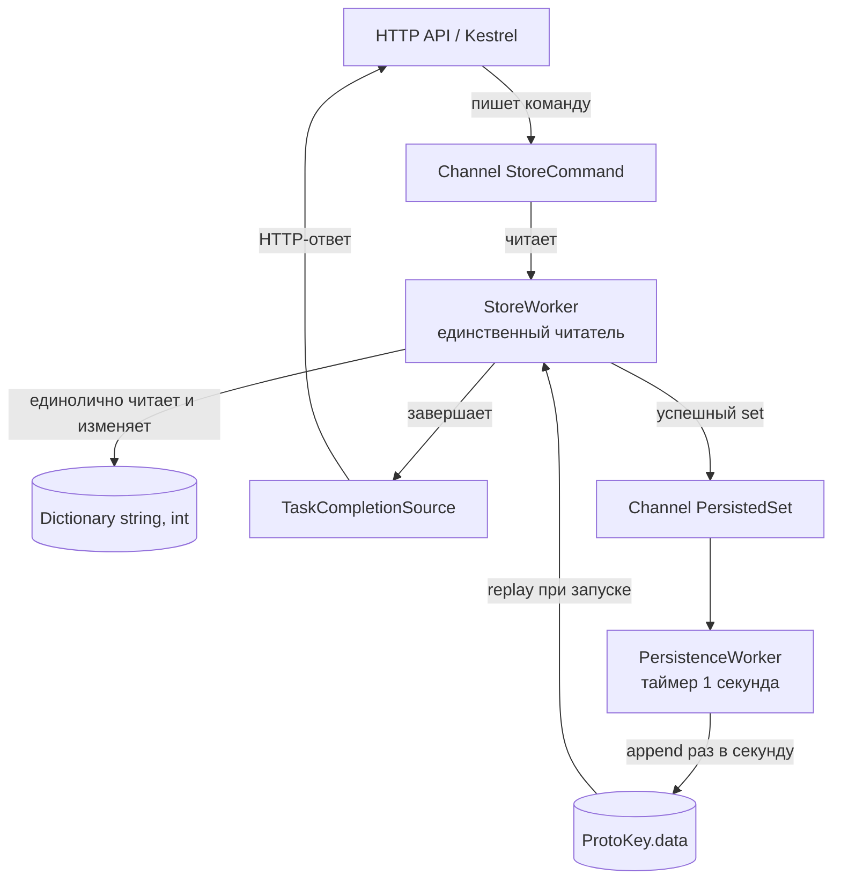
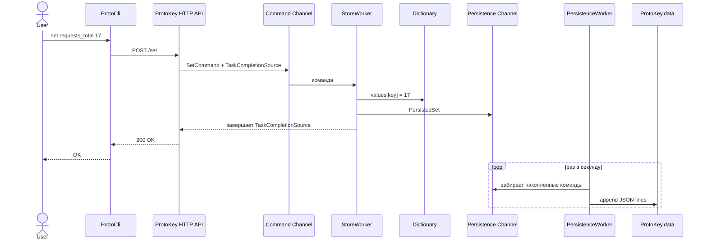

# Диаграммы PA8

## Внутреннее устройство ProtoKey

```mermaid
flowchart TB
    HTTP[HTTP API / Kestrel]
    COMMANDS[Channel StoreCommand]
    STORE[StoreWorker<br/>единственный читатель]
    DICT[(Dictionary string, int)]
    RESPONSES[TaskCompletionSource]
    PERSIST[Channel PersistedSet]
    WRITER[PersistenceWorker<br/>таймер 1 секунда]
    FILE[(ProtoKey.data)]

    HTTP -->|пишет команду| COMMANDS
    COMMANDS -->|читает| STORE
    STORE -->|единолично читает и изменяет| DICT
    STORE -->|завершает| RESPONSES
    RESPONSES -->|HTTP-ответ| HTTP
    STORE -->|успешный set| PERSIST
    PERSIST --> WRITER
    WRITER -->|append раз в секунду| FILE
    FILE -->|replay при запуске| STORE
```

## Последовательность обработки set

```mermaid
sequenceDiagram
    actor User
    participant Cli as ProtoCli
    participant Api as ProtoKey HTTP API
    participant Queue as Command Channel
    participant Worker as StoreWorker
    participant Dict as Dictionary
    participant Persist as Persistence Channel
    participant Writer as PersistenceWorker
    participant File as ProtoKey.data

    User->>Cli: set requests_total 17
    Cli->>Api: POST /set
    Api->>Queue: SetCommand + TaskCompletionSource
    Queue->>Worker: команда
    Worker->>Dict: values[key] = 17
    Worker->>Persist: PersistedSet
    Worker-->>Api: завершает TaskCompletionSource
    Api-->>Cli: 200 OK
    Cli-->>User: OK
    loop раз в секунду
        Writer->>Persist: забирает накопленные команды
        Writer->>File: append JSON lines
    end
```
